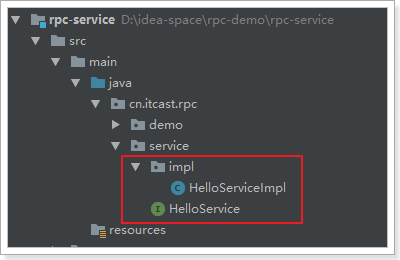
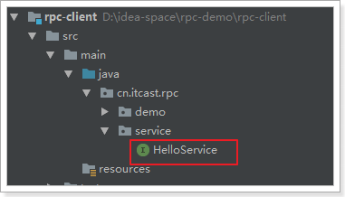

## 2.1、场景模拟

我们先模拟一个远程调用的场景：计算机A提供服务，计算机B远程调用服务。

[2.1.1、服务提供方](#211、服务提供方)

[2.1.2、服务调用方](#212、服务调用方)

### 2.1.1、服务提供方

现在我们创建一个工程rpc-service，模拟计算机A，提供一个简单的服务：



服务接口：

```java
public interface HelloService {
    String sayHello(String name);
}
```

服务的具体实现：

```java
public class HelloServiceImpl implements HelloService{
    public String sayHello(String name) {
        return "hello," + name;
    }
}
```

调用一个本地服务，需要知道是调用哪个类的哪个方法，然后创建对象，调用方法，传递具体参数即可。例如，在计算机A中，我们直接new对象，调用方法即可：

```java
public static void main(String[] args) {
    HelloService service = new  HelloServiceImpl();
    String msg = service.sayHello("Jack");
    System.out.println(msg);// hello, Jack
}
```

### 2.1.2、服务调用方

现在，我们再创建一个工程rpc-client,模拟计算机B,这里只有HelloService接口，没有具体实现。



服务接口：

```java
public interface HelloService {
    String sayHello(String name);
}
```

我们要在计算机B中远程调用计算机A的HelloService服务，该怎么做？

