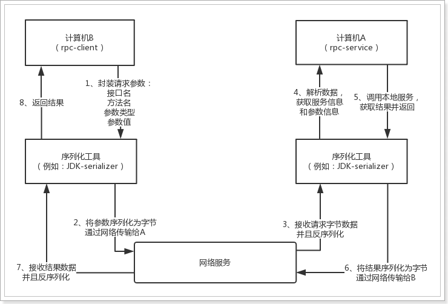

## 2.2、思路分析

在计算机B中，我们确切的知道要调用哪个类的哪个方法，而且知道具体的参数。但问题是:在计算机B中，只有接口，并没有方法的实现，无法直接调用。在计算机A中才有方法的具体实现。因此，现在就需要计算机B来调用计算机A中的方法，并且传参。也就是说：计算机B需要遥控指挥A做事情，把要执行的方法及参数告诉A即可。

如图所示：

整个调用过程分为以下几个步骤：  

- 1）计算机B封装请求的参数信息
- 2）计算机B将请求参数信息序列化（网络传输可以接收的形式）
- 3）计算机A接收请求并进行反序列化，得到请求参数
- 4）计算机A解析请求参数，获取服务信息及参数信息
- 5）计算机A调用本地服务，获取结果
- 6）计算机A将执行的结果序列化
- 7）计算机B接收数据，进行反序列化

这里有两个需要大家注意的地方：

- 序列化和反序列化的方式
  - 就序列化而言，Java 提供了默认的序列化方式，但在高并发的情况下，这种方式将会带来一些性能上的瓶颈，于是市面上出现了一系列优秀的序列化框架，比如：Protobuf、Kryo、Hessian、Jackson 等，它们可以取代 Java 默认的序列化，从而提供更高效的性能。不过在入门案例中，我们先采用Java的默认序列化方式。
- 网络传输的方式
  - 现在主流的RPC框架主要有两种网络传输方式：一种是Http协议，一种是TCP协议。事实上TCP才是底层的传输协议，Http是在TCP基础上进行了封装的应用层协议。大部分情况下，TCP协议的效率会更改。所以我们采用TCP方式传输数据。
  - 而TCP方式又有传统的BIO（阻塞IO），性能更好的NIO（非阻塞IO）。当然我们可以选择非常热门的框架Netty来编写代码。不过因为有一定的学习成本，在入门案例中，我们将采用JDK原生的网络编程来实现。
- 请求参数和响应结果封装
  - 请求参数中需要包含的数据：
    - 服务的接口名
    - 接口中的方法名
    - 方法的参数类型（以防方法重载）
    - 方法的参数值
  - 响应结果要包含的数据：
    - 响应的状态（请求不一定会成功）
    - 异常信息
    - 结果数据

