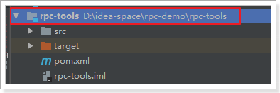
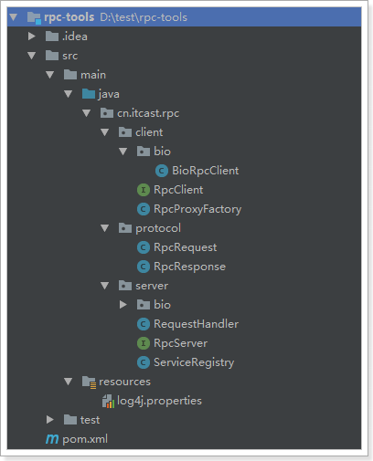

## 2.3、代码实现

我们通过代码来实现刚才的思路：

传送门：

[2.3.1、准备工作](#2.3.1、准备工作)

[2.3.2、请求参数RpcRequest](#2.3.2、请求参数RpcRequest)

[2.3.3、响应参数RpcResponse](#2.3.3、响应参数RpcResponse)

[2.3.4、服务提供方RpcServer](#2.3.4、服务提供方RpcServer)

[2.3.5、服务消费方](#2.3.5、服务消费方)

[2.3.6、项目结构](#2.3.6、项目结构)

[2.3.7、测试](#2.3.7、测试)


### 2.3.1、准备工作

为了便于以后的复用，我们创建一个新的maven工程，编写所有RPC的工具，以后使用时，就可以直接引入坐标即可。



列出我们需要编写的部分：

- 对外提供的服务（已完成，就是rpc-service中定义的`HelloService`）
- 服务提供方（rpc-service，需要通过`ServerSocket`对外提供服务）
- 服务消费方（rpc-client，需要通过`Socket`连接rpc-service，实现远程访问）
  - **需要注意的是，客户端只有服务接口，并没有实现类，所以我们需要利用动态代理的方式为这个接口生成一个实现类，然后在代理方法中，通过远程连接发起请求到达服务端，获取响应结果并返回。**
- 序列化和反序列化：采用JDK默认的序列化
- 请求参数封装
- 响应参数封装


### 2.3.2、请求参数RpcRequest

注意，因为要使用JDK的序列化，因此该类**需要实现`Serializable`接口**：

```java
/**
 * @author: HuYi.Zhang
 */
public class RpcRequest implements Serializable{

    private static final long serialVersionUID = 1L;
    private String className;
    private String methodName;
    private Class<?>[] parameterTypes;
    private Object[] parameters;

    public String getClassName() {
        return className;
    }

    public void setClassName(String className) {
        this.className = className;
    }

    public String getMethodName() {
        return methodName;
    }

    public void setMethodName(String methodName) {
        this.methodName = methodName;
    }

    public Class<?>[] getParameterTypes() {
        return parameterTypes;
    }

    public void setParameterTypes(Class<?>[] parameterTypes) {
        this.parameterTypes = parameterTypes;
    }

    public Object[] getParameters() {
        return parameters;
    }

    public void setParameters(Object[] parameters) {
        this.parameters = parameters;
    }
}
```


### 2.3.3、响应参数RpcResponse

与RpcRequest一样，这里也需要实现Serializable接口：

另外为了使用方便，我们定义了几个静态方法，用来生成该类实例：

- `ok(Object data)` 表示响应成功，接收要返回的数据
- `error(String error)` 表示响应失败，接收错误信息
- `build(int stastus, String error, Object data)` 用来自定义返回状态和消息

```java
/**
 * @author: HuYi.Zhang
 **/
public class RpcResponse implements Serializable{

    private static final long serialVersionUID = 2L;
    private int status;// 响应状态 0失败，1成功
    private String error;// 错误信息
    private Object data;// 返回结果数据

    public static RpcResponse ok(Object data) {
        return build(1, null, data);
    }

    public static RpcResponse error(String error) {
        return build(0, error, null);
    }

    public static RpcResponse build(int status, String error, Object data) {
        RpcResponse r = new RpcResponse();
        r.setStatus(status);
        r.setError(error);
        r.setData(data);
        return r;
    }

    public int getStatus() {
        return status;
    }

    public void setStatus(int status) {
        this.status = status;
    }

    public String getError() {
        return error;
    }

    public void setError(String error) {
        this.error = error;
    }

    public Object getData() {
        return data;
    }

    public void setData(Object data) {
        this.data = data;
    }
}
```


### 2.3.4、服务提供方RpcServer

服务端的实现方式多种多样，可以用BIO、NIO、AIO来实现，为了便于后期扩展，这里先定义一个接口：

```java
/**
 * RPC的服务端接口
 * @author HuYi.Zhang
 */
public interface RpcServer {
    /**
     * 启动服务
     */
    void start();

    /**
     * 停止服务
     */
    void stop();
}

```

#### 2.3.4.1、服务端要做的事情

我们思考一下服务端要做的事情：

- 1）启动服务：根据指定端口，启动一个`ServerSocket`，等待客户端连接
- 2）请求处理：接收客户端连接，接收请求（`RpcRequest`）并解析请求，得到要调用的接口信息
- 3）服务发现：根据接口查找接口的具体实现
- 4）本地执行：执行接口中的方法，获取响应结果（`RpcResponse`）
- 5）返回结果

需要注意的是：

- 服务发现阶段需要从众多的类中，找到已知接口的实现，比较麻烦。为了方便查找，我们可以在一开始就将所有接口及其实现类关系缓存，实现简单的**服务注册**。
- 解析`RpcRequest`，返回`RpcRespon`的流程，在以后其它的`RpcServer`实现类中也会用到，为了复用性，我们可以进行抽取。


#### 2.3.4.2、服务注册器ServiceRegistry

当请求到达，我们就需要根据请求的接口信息，找到对应的实现类。因此，我们最好提前把所有要对外提供的服务，提前记录在一个地方，方便以后寻找。

我们定义一个类ServiceRegistry，在服务启动前，先向其中注册服务。这里我们先手动注册服务，以后再考虑实现自动扫描并注册服务：

```java

/**
 * @author: HuYi.Zhang
 **/
public class ServiceRegistry{

    private static final Logger logger = LoggerFactory.getLogger(ServiceRegistry.class);

    private static final Map<String, Object> registeredServices = new HashMap<>();

    public static <T> T getService(String className) {
        return (T) registeredServices.get(className);
    }

    public static void registerService(Class<?> interfaceClass, Class<?> implClass) {
        try {
            registeredServices.put(interfaceClass.getName(), implClass.newInstance());
            logger.info("服务注册成功,接口：{},实现{}", interfaceClass.getName(), implClass.getName());
        } catch (Exception e) {
            e.printStackTrace();
            logger.error("服务" + implClass + "注册失败", e);
        }
    }
}
```


#### 2.3.4.3、请求处理器RequestHandler

处理请求，获取响应的过程在`RpcServer`的各个实现类中都可能会用到，所以我们进行抽取：

```java
/**
 * @author: HuYi.Zhang
 **/
public class RequestHandler {

    private static final Logger logger = LoggerFactory.getLogger(RequestHandler.class);

    public static RpcResponse handleRequest(RpcRequest request) {
        try {
            // 获取服务
            Object service = ServiceRegistry.getService(request.getClassName());
            if (service != null) {
                Class<?> clazz = service.getClass();
                // 获取方法
                Method method = clazz.getMethod(request.getMethodName(),
                        request.getParameterTypes());
                // 执行方法
                Object result = method.invoke(service, request.getParameters());
                // 写回结果
                return RpcResponse.ok(result);
            } else {
                logger.error("请求的服务未找到:{}.{}({})",
                        request.getClassName(),
                        request.getMethodName(),
                        StringUtils.join(request.getParameterTypes(), ", "));
                return RpcResponse.error("未知服务！");
            }
        } catch (Exception e) {
            e.printStackTrace();
            logger.error("处理请求失败", e);
            return RpcResponse.error(e.getMessage());
        }
    }
}
```


#### 2.3.4.4、服务端BioRpcServer

入门案例中，我们先通过BIO方式实现`RpcServer`类：

```java
/**
 * BIO的RPC服务端
 *
 * @author HuYi.Zhang
 */
public class BioRpcServer implements RpcServer{

    private static final Logger logger = LoggerFactory.getLogger(BioRpcServer.class);
    // 用来处理请求的连接池
    private static final ExecutorService es = Executors.newCachedThreadPool();

    private int port = 9000;// 默认端口

    private volatile boolean shutdown = false;// 是否停止

    /**
     * 使用默认端口9000，构建一个BIO的RPC服务端
     */
    public BioRpcServer() {
    }

    /**
     * 使用指定端口构建一个BIO的RPC服务端
     *
     * @param port 服务端端口
     */
    public BioRpcServer(int port) {
        this.port = port;
    }

    @Override
    public void start() {
        try {
            // 启动服务
            ServerSocket server = new ServerSocket(this.port);
            logger.info("服务启动成功，端口：{}", this.port);
            while (!this.shutdown) {
                // 接收客户端请求
                Socket client = server.accept();
                es.execute(() -> {
                    try (
                            // 使用JDK的序列化流
                            ObjectInputStream in = new ObjectInputStream(client.getInputStream());
                            ObjectOutputStream out = new ObjectOutputStream(client.getOutputStream())
                    ) {
                        // 读取请求参数
                        RpcRequest request = (RpcRequest) in.readObject();
                        logger.info("接收请求，{}.{}({})",
                                request.getClassName(),
                                request.getMethodName(),
                                StringUtils.join(request.getParameterTypes(), ", "));
                        logger.info("请求参数：{}",
                                StringUtils.join(request.getParameters(), ", "));
                        // 处理请求
                        out.writeObject(RequestHandler.handleRequest(request));
                    } catch (Exception e) {
                        logger.error("客户端连接异常，客户端{}:{}", client.getInetAddress().toString());
                        throw new RuntimeException(e);
                    }
                });
            }
        } catch (IOException e) {
            e.printStackTrace();
            logger.error("服务启动失败", e);
        }
    }

    @Override
    public void stop() {
        this.shutdown = true;
        logger.info("服务即将停止");
    }
}
```


### 2.3.5、服务消费方

#### 2.3.5.1、客户端接口RpcClient

同`RpcServer`一样，我们先定义一个接口：

客户端做的事情比较单一，发起`RpcRequest`请求，获取响应并解析即可。

```java
/**
 * RPC客户端
 * @author HuYi.Zhang
 */
public interface RpcClient {

    /**
     * 发起请求，获取响应
     * @param request
     * @return
     */
    RpcResponse sendRequest(RpcRequest request) throws Exception;
}
```


#### 2.3.5.2、客户端实现BioRpcClient

然后实现一个BIO的客户端：

```java
/**
 * RPC客户端的BIO实现
 *
 * @author HuYi.Zhang
 */
public class BioRpcClient implements RpcClient {

    private static final Logger logger = LoggerFactory.getLogger(BioRpcClient.class);

    private String host;

    private int port;


    public BioRpcClient(String host, int port) throws IOException {
        this.host = host;
        this.port = port;
    }

    @Override
    public RpcResponse sendRequest(RpcRequest request) throws Exception{
        try (
                Socket socket = new Socket(host, port);
                ObjectOutputStream out = new ObjectOutputStream(socket.getOutputStream());
                ObjectInputStream in = new ObjectInputStream(socket.getInputStream())
        ) {
            logger.info("建立连接成功：{}：{}", host, port);
            // 发起请求
            out.writeObject(request);
            logger.info("发起请求,目标主机{}:{}，服务：{}.{}({})", host, port,
                    request.getClassName(), request.getMethodName(),
                    StringUtils.join(request.getParameterTypes(), ","));
            // 获取结果
            return (RpcResponse) in.readObject();
        }
    }
}
```


#### 2.3.5.3、动态代理工厂RpcProxyFactory

刚刚实现的`RpcClient`中，我们实现了发起请求，获取响应的功能。那么问题来了：

> 谁来发起请求？
>
> 谁来解析响应？


根据我们前面的分析，客户端（计算机B）只有`HelloService`接口，并没有具体的实现。我们需要通过动态代理为HelloService生成实现类。当有人调用`HelloService`的`sayHello()`方法时，底层可以调用`RpcClient`的`sendRequset()`功能向服务端（计算机A）发起请求，获取执行结果。

不管接口是什么，生成动态代理的代码和逻辑几乎是一样的。因此我们可以抽取出一个生成代理的工厂：

```java
/**
 * 一个动态代理工厂，为接口生成实现了Rpc远程调用的实现类。
 * @author: HuYi.Zhang
 **/
public class RpcProxyFactory<T> implements InvocationHandler {

    private static final Logger logger = LoggerFactory.getLogger(RpcProxyFactory.class);
    private Class<T> clazz;

    public RpcProxyFactory(Class<T> clazz) {
        this.clazz = clazz;
    }

    public T getProxyObject() {
        return (T) Proxy.newProxyInstance(clazz.getClassLoader(), new Class[]{clazz}, this);
    }

    @Override
    public Object invoke(Object proxy, Method method, Object[] args) {
        // 处理Object中的方法
        if (Object.class == method.getDeclaringClass()) {
            String name = method.getName();
            if ("equals".equals(name)) {
                return proxy == args[0];
            } else if ("hashCode".equals(name)) {
                return System.identityHashCode(proxy);
            } else if ("toString".equals(name)) {
                return proxy.getClass().getName() + "@" +
                        Integer.toHexString(System.identityHashCode(proxy)) +
                        ", with InvocationHandler " + this;
            } else {
                throw new IllegalStateException(String.valueOf(method));
            }
        }
        // 封装请求参数
        RpcRequest request = new RpcRequest();
        request.setClassName(clazz.getName());
        request.setMethodName(method.getName());
        request.setParameters(args);
        request.setParameterTypes(method.getParameterTypes());
        try {
            // 发起网络请求,并接收响应
            RpcClient client = new BioRpcClient("127.0.0.1", 9000);
            RpcResponse response = client.sendRequest(request);
            // 解析并返回
            if (response.getStatus() == 1) {
                logger.info("调用远程服务成功！");
                return response.getData();
            }
            logger.debug("远程服务调用失败，{}。", response.getError());
            return null;
        } catch (Exception e) {
            logger.error("远程调用异常", e);
            throw new RuntimeException(e);
        }
    }
}
```


### 2.3.6、项目结构

如图：




### 2.3.7、测试

在rpc-service中编写测试类，启动一个服务端：

```java
public class RpcServerTest {
    @Test
    public void test01() throws InterruptedException {
        // 注册服务
        ServiceRegistry.registerService(HelloService.class, HelloServiceImpl.class);
        // 启动服务
        new BioRpcServer(9000).start();
    }
}
```

运行日志：

```verilog
2018-03-16 16:14:31  INFO BioRpcServer:69 - 注册服务cn.itcast.rpc.service.HelloService,实现类cn.itcast.rpc.service.impl.HelloServiceImpl
2018-03-16 16:14:31  INFO BioRpcServer:78 - 服务启动成功，端口：9000
```


在rpc-client中启动一个客户端：

```java
public class RpcClientTest {
    @Test
    public void test01(){
        // 通过代理工厂，获取服务
        HelloService helloService = new RpcProxyFactory<>(HelloService.class).getProxyObject();
        // 调用服务
        String result = helloService.sayHello("Jack");
        System.out.println(result);
        Assert.assertEquals("调用失败", "hello, Jack", result);
    }
}

```

运行后，服务端日志：

```verilog
2018-03-16 16:14:37  INFO BioRpcServer:113 - 接收请求，cn.itcast.rpc.service.HelloService.sayHello(class java.lang.String)
2018-03-16 16:14:37  INFO BioRpcServer:117 - 请求参数：Jack
```

客户端日志：

```verilog
2018-03-18 14:23:39  INFO BioRpcClient:44 - 建立连接成功：127.0.0.1：9000
2018-03-18 14:23:39  INFO BioRpcClient:47 - 发起请求,目标主机127.0.0.1:9000，服务：cn.itcast.rpc.service.HelloService.sayHello(class java.lang.String)
2018-03-18 14:23:39  INFO RpcProxyFactory:61 - 调用远程服务成功！
hello, Jack
```

到这里为止，一个简单的RPC框架就实现了！