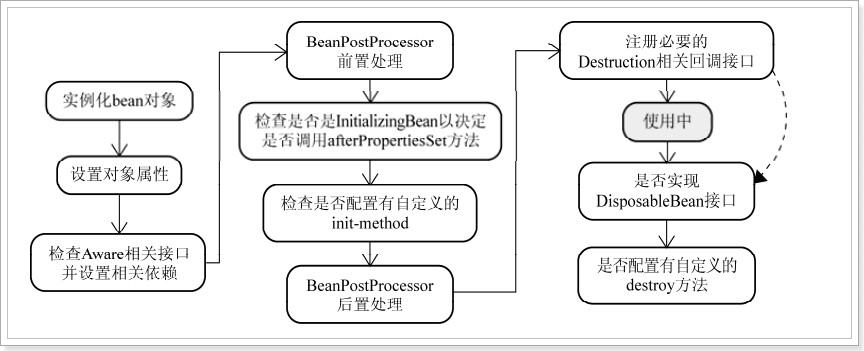
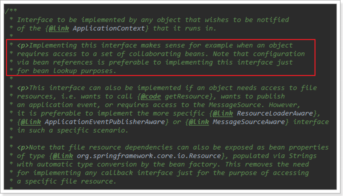
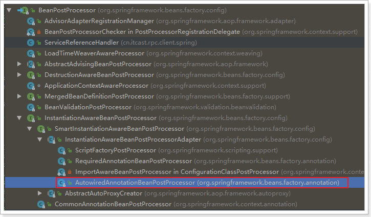

## 3.1、与spring整合

Spring几乎是现在开发JavaEE的必备框架，特别是在SpringBoot出现以后，其快速搭建项目的功能一直被人们津津乐道。当然Spring的核心功能AOP和依赖注入功能，也非常强大。我们接下来就利用Spring的依赖注入功能，将服务通过注解直接扫描并注册到Spring容器，并且可以通过依赖注入功能实现自动注入。

快速通道：

* [3.1.1、服务的自动注册](#311、服务的自动注册)
  * [3.1.1.1、将接口的实现类注册到Spring容器](#3111、将接口的实现类注册到spring容器)
  * [3.1.1.2、将接口和实现类注册到ServiceRegistry](#3112、将接口和实现类注册到serviceregistry)
* [3.1.2、服务端RpcServer与Spring整合](#312、服务端rpcserver与spring整合)
* [3.1.3、服务端测试](#313、服务端测试)
* [3.1.4、客户端实现服务的依赖注入](#314、客户端实现服务的依赖注入)
  * [3.1.4.1、需求](#3141、需求)
  * [3.1.4.2、@Autowired的原理](#3142、autowired的原理)
  * [3.1.4.3、实现自动注入](#3143、实现自动注入)
* [3.1.5、客户端测试](#315、客户端测试)

### 3.1.1、服务的自动注册

在刚才的案例中，我们要在服务端注册一个服务，需要通过下面的方式手动注册：

```java
// 注册服务
ServiceRegistry.registerService(HelloService.class, HelloServiceImpl.class);
```

这种方式兼职弱爆了。我们回忆一下Spring的功能，在spring中提供了以下一些注解：

* `@Component`
* `@Service`
* `@Controller`
* `@Reponsitory`

如果想要一个Bean加入Spring容器，只需要使用上面任意一个注解即可。我们能不能通过类似的方式来实现将服务自动注册到Spring，并且注册到`ServiceRegistry`的功能呢？

先来看看我们要达到的目标：

* 1）将接口的实现类注册到Spring容器
* 2）将接口和实现类信息保存到ServiceRegistry中，方便以后查找

好了，接下来我们分别实现这两个目标

#### 3.1.1.1、将接口的实现类注册到Spring容器

相信大家很快就能想到：我们直接在实现类上加上前面提到过的Spring提供的任意一个注解就可以实现了。

没错，这样确实能达到目的。但是大家思考一下，如果我们使用Spring提供的注解，那么我们将来如何能知道Spring容器中的哪些类是需要注册到`ServiceRegistry`的呢？

所以，我们不能使用Spring的注解，这样就产生了新的问题：

* 如果我们不使用Spring的注解，Spring就不会主动把类注册到Spring容器了。

这个问题其实很好解决，大家看一下spring的`@Service`或者`@Controller`源码就明白了：

```java
/**
 * Indicates that an annotated class is a "Controller" (e.g. a web controller).
 *
 * <p>This annotation serves as a specialization of {@link Component @Component},
 * allowing for implementation classes to be autodetected through classpath scanning.
 * It is typically used in combination with annotated handler methods based on the
 * {@link org.springframework.web.bind.annotation.RequestMapping} annotation.
 *
 * @author Arjen Poutsma
 * @author Juergen Hoeller
 * @since 2.5
 * @see Component
 * @see org.springframework.web.bind.annotation.RequestMapping
 * @see org.springframework.context.annotation.ClassPathBeanDefinitionScanner
 */
@Target({ElementType.TYPE})
@Retention(RetentionPolicy.RUNTIME)
@Documented
@Component
public @interface Controller {

    /**
     * The value may indicate a suggestion for a logical component name,
     * to be turned into a Spring bean in case of an autodetected component.
     * @return the suggested component name, if any (or empty String otherwise)
     */
    String value() default "";

}
```

我们可以发现，在`@Controller`注解上，其实有一个`@Component`注解，然后类上的一段注释：

```wiki
This annotation serves as a specialization of @Component,allowing for implementation classes to be autodetected through classpath scanning.
此类作为@Componet注解的一个特例，运行通过类路径自动扫描获取实现类。
```

也就是说，一个自定义注解，只要加上了`@Component`注解，就会起到跟`@Component`一样的作用，被标记的类会被Spring自动扫描，并加入spring容器中。

所以，我们定义一个自定义注解，用来识别需要对外提供的服务：

```java
/**
 * 用来标记RPC服务，并且声明其接口
 * @author: HuYi.Zhang
 **/
@Target({ElementType.TYPE})
@Retention(RetentionPolicy.RUNTIME)
@Component
public @interface Service {

    /**
     * 接口名称
     * @return
     */
    Class<?> value();
}
```

这个注解需要接收value属性，用来指定被标记的类所实现的接口。

接下来，我们就可以在`HelloServiceImpl`上使用这个自定义的注解了：

```java
@Service(HelloService.class)
public class HelloServiceImpl implements HelloService{
    public String sayHello(String name) {
        return "hello, " + name;
    }
}
```

#### 3.1.1.2、将接口和实现类注册到ServiceRegistry

我们已经将`HelloServiceImpl`注册到Spring容器了。下一步动作，就是将该实现类及其接口HelloService信息注册到`ServiceRegistry`中。

这一步动作，我们也希望由Spring来帮我们完成，怎么做呢？

实现的方式有很多种，我们这里介绍其中一种，使用`ApplicationContextAware`接口。

```java
public interface ApplicationContextAware extends Aware {

   /**
    * Set the ApplicationContext that this object runs in.
    * Normally this call will be used to initialize the object.
    * <p>Invoked after population of normal bean properties but before an init callback such
    * as {@link org.springframework.beans.factory.InitializingBean#afterPropertiesSet()}
    * or a custom init-method. Invoked after {@link ResourceLoaderAware#setResourceLoader},
    * {@link ApplicationEventPublisherAware#setApplicationEventPublisher} and
    * {@link MessageSourceAware}, if applicable.
    * @param applicationContext the ApplicationContext object to be used by this object
    * @throws ApplicationContextException in case of context initialization errors
    * @throws BeansException if thrown by application context methods
    * @see org.springframework.beans.factory.BeanInitializationException
    */
   void setApplicationContext(ApplicationContext applicationContext) throws BeansException;

}
```

这个东西是干什么的呢？

我们先看一下Spring初始化Bean的流程：



当Spring对所有Bean进行实例化后，会完成对属性的设置。然后会检查有没有类实现了与Aware相关的接口，并且处理，我们的`ApplicationContextAware`就是其中之一。

在这个接口上有这么一段注释：



翻译一下：

​    当一个对象需要访问容器一些bean时，可以实现这个接口，否则就没有必要。 请注意，通过Bean引用进行配置优于为了bean查找目的而实现此接口。

当一个类实现`ApplicationContextAware`接口时，spring扫描到以后，就会调用`setApplicationContext`方法，将spring容器传递给这个方法中。拿到了容器，我们就可以从中寻找带有我们自定义注解@Service的类了。

我们改造ServiceRegistry，让它实现`ApplicationContextAware`接口：

```java
/**
 * @author: HuYi.Zhang
 **/
public class ServiceRegistry implements ApplicationContextAware {

    private static final Logger logger = LoggerFactory.getLogger(ServiceRegistry.class);

    private static final Map<String, Object> registeredServices = new HashMap<>();

    public static <T> T getService(String className) {
        return (T) registeredServices.get(className);
    }

    public static void registerService(Class<?> interfaceClass, Class<?> implClass) {
        try {
            registeredServices.put(interfaceClass.getName(), implClass.newInstance());
            logger.info("服务注册成功,接口：{},实现{}", interfaceClass.getName(), implClass.getName());
        } catch (Exception e) {
            e.printStackTrace();
            logger.error("服务" + implClass + "注册失败", e);
        }
    }

    @Override
    public void setApplicationContext(ApplicationContext ctx) throws BeansException {
        Map<String, Object> services = ctx.getBeansWithAnnotation(Service.class);
        if (services != null && services.size() > 0) {
            for (Object service : services.values()) {
                String interfaceName = service.getClass().getAnnotation(Service.class).value().getName();
                registeredServices.put(interfaceName, service);
                logger.info("加载服务：{}", interfaceName);
            }
        }
    }
}
```

这样以来，我们就不需要手动注册服务了！

### 3.1.2、服务端RpcServer与Spring整合

要把RpcServer与Spring整合，就需要Bean能够在初始化完成后启动，我们可以给BioRpcServer添加一个初始化方法`init()`。还需要添加一个注解`@PostConstructor`，这样Spring在初始化完成后，会自动调用该方法。另外，可以给stop方法添加`@PreDestroy`注解，这样Spring会在Bean销毁前调用该方法，将服务停止。

```java
@Override
@PreDestroy
public void stop() {
    this.shutdown = true;
    logger.info("服务即将停止");
}

@PostConstruct
public void init(){
    es.submit(this::start);
}
```

**注意**：因为`start()`方法是**阻塞**的，所以不能在`init()`方法中直接调用`start()`，会导致Spring线程阻塞，所以我们在init中开启线程来异步执行`start()`方法；

### 3.1.3、服务端测试

首先编写配置类，将注册器ServiceRegistry及服务端BioRpcServer注册到Spring：

这里我们采用Java配置方式，千万不要忘了指定扫描包：

```java
/**
 * @author: HuYi.Zhang
 **/
@Configuration
@ComponentScan(basePackages = "cn.itcast.rpc.service")
public class RpcServerConfig {

    /**
     * BIO的RPC服务端
     * @return
     */
    @Bean
    public RpcServer rpcServer() {
        return new BioRpcServer();
    }

    /**
     * 服务的自动注册器
     * @return
     */
    @Bean
    public ServiceRegistry serviceRegistry(){
        return new ServiceRegistry();
    }
}
```

编写测试类，我们并不需要手动注册任何服务：

```java
/**
 * @author: HuYi.Zhang
 **/
@RunWith(SpringJUnit4ClassRunner.class)
@ContextConfiguration(classes = RpcServerConfig.class)
public class RpcServerTestWithSpring {

    @Test
    public void test01() throws InterruptedException {
        // spring会自动注册服务，只要保证容器存活即可
        Thread.sleep(Integer.MAX_VALUE);
    }
}
```

启动并查看日志：

```verilog
2018-03-18 17:31:45  INFO DefaultTestContextBootstrapper:248 - Loaded default TestExecutionListener class names from location [META-INF/spring.factories]: [org.springframework.test.context.web.ServletTestExecutionListener, org.springframework.test.context.support.DirtiesContextBeforeModesTestExecutionListener, org.springframework.test.context.support.DependencyInjectionTestExecutionListener, org.springframework.test.context.support.DirtiesContextTestExecutionListener, org.springframework.test.context.transaction.TransactionalTestExecutionListener, org.springframework.test.context.jdbc.SqlScriptsTestExecutionListener]

2018-03-18 17:31:45  INFO DefaultTestContextBootstrapper:174 - Using TestExecutionListeners: [org.springframework.test.context.support.DirtiesContextBeforeModesTestExecutionListener@39fb3ab6, org.springframework.test.context.support.DependencyInjectionTestExecutionListener@6276ae34, org.springframework.test.context.support.DirtiesContextTestExecutionListener@7946e1f4]2018-03-18 17:31:45  INFO GenericApplicationContext:583 - Refreshing org.springframework.context.support.GenericApplicationContext@1e88b3c: startup date [Sun Mar 18 17:31:45 CST 2018]; root of context hierarchy

2018-03-18 17:31:46  INFO ServiceRegistry:44 - 加载服务：cn.itcast.rpc.service.HelloService

2018-03-18 17:31:46  INFO BioRpcServer:60 - 服务启动成功，端口：9000
```

### 3.1.4、客户端实现服务的依赖注入

#### 3.1.4.1、需求

在前面的案例中，客户端要想获取服务，需要手动创建`RpcProxyFactory`实例，并从中获取服务的代理：

```java
// 通过代理工厂，获取服务
HelloService helloService = new RpcProxyFactory<>(HelloService.class).getProxyObject();
```

这样太麻烦了，能不能像Spring中那样，通过`@Autowired`实现自动的依赖注入呢？

要想通过`@Autowired`自动注入，就必须在Spring容器中有对应的实例对象。然而在客户端只有接口，并没有实现类，更不会有对象，所以无法通过`@Autowired`自动注入。

我们能不能模拟`@Autowired`功能，自己来实现依赖注入呢？

#### 3.1.4.2、@Autowired的原理

先来看一下Spring的Bean初始化流程：


执行流程：

* 1）所有的Bean实例化
* 2）对Bean的属性进行初始化
* 3）检查Aware相关接口
* 4）执行BeanPostProcessor的前置方法
* 5）处理实现了InitializingBean的类
* 6）处理添加了自定义init-method的类
* 7）BeanPostProcessor的后置方法
* ...

我们需要注意其中的BeanPostProcessor这个东西：

`BeanPostProcessor`接口中定义了两个方法：

```java
/**
 * Factory hook that allows for custom modification of new bean instances,
 * e.g. checking for marker interfaces or wrapping them with proxies.
 * ...
 * 运行客户对 bean 进行自定义修改的 Bean工厂钩子（hook），Spring通过该接口作为标记进行检查
 *
 * <p>ApplicationContexts can autodetect BeanPostProcessor beans in their
 * bean definitions and apply them to any beans subsequently created.
 * ...
 * ApplicationContexts 可以自动检测到实现该接口的Bean，并且在任何其他Bean创建之后执行它。
 * 略...
 */
public interface BeanPostProcessor {

    /**
     * Apply this BeanPostProcessor to the given new bean instance <i>before</i> any bean
     * initialization callbacks (like InitializingBean's {@code afterPropertiesSet}
     * or a custom init-method). 
     * 前置方法：在给定的这个bean的初始化方法（afterPropertiesSet或init-method）执行之前执行。
     * 略...
     */
    Object postProcessBeforeInitialization(Object bean, String beanName) throws BeansException;

    /**
     * Apply this BeanPostProcessor to the given new bean instance <i>after</i> any bean
     * initialization callbacks (like InitializingBean's {@code afterPropertiesSet}
     * or a custom init-method). 
     * 后置方法：在给定的这个bean的初始化方法（afterPropertiesSet或init-method）执行之后执行。
     * 略...
     */
    Object postProcessAfterInitialization(Object bean, String beanName) throws BeansException;

}
```

再来了解一下`@Autowired`的实现原理，Spring正是通过一个BeanPostProcessor来实现`@Autowired`自动注入的：



我们看类上的一段说明：

```wiki
org.springframework.beans.factory.config.BeanPostProcessor implementation that autowires annotated fields, setter methods and arbitrary config methods.Such members to be injected are detected through a Java 5 annotation: by default,Spring's @Autowired and @Value annotations.

org.springframework.beans.factory.config.BeanPostProcessor 的一个实现，用来自动注入带有Autowired注解的字段、setter方法和任意配置方法。默认情况下，这些成员可以通过Java 5注解检测到，包括Spring的@Autowired和@Value注释。
```

总结：

​    Spring在实例化完成所有Bean以后，会检查Bean上是否实现了`BeanPostProcessor`接口，如果有就会在任何普通Bean初始化时，先调用该接口的前置方法：`postProcessBeforeInitialization()`，然后进行普通Bean的初始化。然后再调用后置方法：`postProcessAfterInitialization()`。

​    `@Autowired`注解正是利用了这个接口的特性，编写了一个`AutowiredAnnotationBeanPostProcessor`，然后在其中对每一个Bean的成员进行检测，如果发现实现了`@Autowired`注解或者`@Value`注解（也支持JSR-330的注解），就会对其进行注入。

#### 3.1.4.3、实现自动注入

思路：

​    我们也可以通过自定义注解的方式，来标记这些需要注入的属性。然后实现一个`BeanPostProcessor`，在普通Bean初始化的时候进行拦截。如果发现我们的自定义标记，则通过`RpcProxFactory`来生成代理并且注入。

首先，编写一个自定义注解，用来标记需要注入的成员：

```java
/**
 * 标记一个需要通过RPC注入的资源
 * @author: HuYi.Zhang
 * @create: 2018-03-16 22:04
 **/
@Target({ElementType.FIELD})
@Retention(RetentionPolicy.RUNTIME)
public @interface Reference {
}
```

然后，再编写一个`BeanPostProcessor`：

```java
/**
 * Bean的后处理器，用来注入Rpc的动态代理对象
 * @author: HuYi.Zhang
 **/
public class RpcProxyBeanPostProcessor implements BeanPostProcessor {

    private static final Logger logger = LoggerFactory.getLogger(RpcProxyBeanPostProcessor.class);

    private final Map<Class<?>, Object> cache = new HashMap<>();

    @Override
    public Object postProcessBeforeInitialization(Object bean, String beanName) throws BeansException {
        return bean;
    }

    @Override
    public Object postProcessAfterInitialization(Object bean, String beanName) throws BeansException {
        // 遍历所有字段
        for (Field f : bean.getClass().getDeclaredFields()) {
            // 判断是否有@Reference注解
            if (f.isAnnotationPresent(Reference.class)) {
                f.setAccessible(true);
                Class<?> clazz = f.getType();
                Object proxy = null;
                // 判断该字段类型在缓存中是否存在
                if (cache.containsKey(clazz)) {
                    proxy = cache.get(clazz);
                } else {
                    // 动态代理生成对象
                    proxy = new RpcProxyFactory<>(clazz).getProxyObject();
                    cache.put(bean.getClass(), proxy);
                }
                try {
                    f.set(bean, proxy);
                    logger.info("为{}注入{}。", f, proxy);
                } catch (Exception e) {
                    e.printStackTrace();
                    logger.error("属性" + f + "注入失败", e);
                }
            }
        }
        return bean;
    }
}
```

### 3.1.5、客户端测试

首先编写Spring的配置类，只需要把自定义的`BeanPostProcessor`注册就可以了：

```java
@Configuration
public class RpcClientConfig {

    /**
     * 处理@Refrence注解标记的属性自动注入
     * @return
     */
    @Bean
    public RpcProxyBeanPostProcessor serviceReferenceHandler() {
        return new RpcProxyBeanPostProcessor();
    }

}
```

测试类：

```java
@RunWith(SpringJUnit4ClassRunner.class)
@ContextConfiguration(classes = RpcClientConfig.class)
public class RpcClientTestWithSpring {

    @Reference
    private HelloService helloService;// 自动注入，无需手动获取

    @Test
    public void test01() {
        String result = this.helloService.sayHello("Jack");
        System.out.println(result);
        Assert.assertEquals("调用失败", "hello, Jack", result);
    }
}
```

启动并查看日志：

```verilog
2018-03-18 17:38:34  INFO DefaultTestContextBootstrapper:248 - Loaded default TestExecutionListener class names from location [META-INF/spring.factories]: [org.springframework.test.context.web.ServletTestExecutionListener, org.springframework.test.context.support.DirtiesContextBeforeModesTestExecutionListener, org.springframework.test.context.support.DependencyInjectionTestExecutionListener, org.springframework.test.context.support.DirtiesContextTestExecutionListener, org.springframework.test.context.transaction.TransactionalTestExecutionListener, org.springframework.test.context.jdbc.SqlScriptsTestExecutionListener]
2018-03-18 17:38:34  INFO DefaultTestContextBootstrapper:174 - Using TestExecutionListeners: [org.springframework.test.context.support.DirtiesContextBeforeModesTestExecutionListener@5cc7c2a6, org.springframework.test.context.support.DependencyInjectionTestExecutionListener@b97c004, org.springframework.test.context.support.DirtiesContextTestExecutionListener@4590c9c3]2018-03-18 17:38:34  INFO GenericApplicationContext:583 - Refreshing org.springframework.context.support.GenericApplicationContext@5e3a8624: startup date [Sun Mar 18 17:38:34 CST 2018]; root of context hierarchy
2018-03-18 17:38:34  INFO PostProcessorRegistrationDelegate$BeanPostProcessorChecker:327 - Bean 'rpcClientConfig' of type [cn.itcast.rpc.config.RpcClientConfig$$EnhancerBySpringCGLIB$$c5d66a2a] is not eligible for getting processed by all BeanPostProcessors (for example: not eligible for auto-proxying)
2018-03-18 17:38:34  INFO RpcProxyBeanPostProcessor:47 - 为private cn.itcast.rpc.service.HelloService cn.itcast.rpc.RpcClientTestWithSpring.helloService注入com.sun.proxy.$Proxy17@e056f20, with InvocationHandler cn.itcast.rpc.client.RpcProxyFactory@4b0b0854。
2018-03-18 17:38:34  INFO BioRpcClient:44 - 建立连接成功：127.0.0.1：9000
2018-03-18 17:38:34  INFO BioRpcClient:47 - 发起请求,目标主机127.0.0.1:9000，服务：cn.itcast.rpc.service.HelloService.sayHello(class java.lang.String)
2018-03-18 17:38:34  INFO RpcProxyFactory:61 - 调用远程服务成功！
hello, Jack
2018-03-18 17:38:34  INFO GenericApplicationContext:984 - Closing org.springframework.context.support.GenericApplicationContext@5e3a8624: startup date [Sun Mar 18 17:38:34 CST 2018]; root of context hierarchy
```


